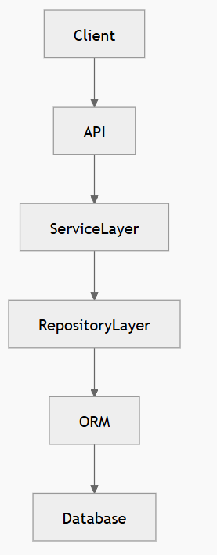
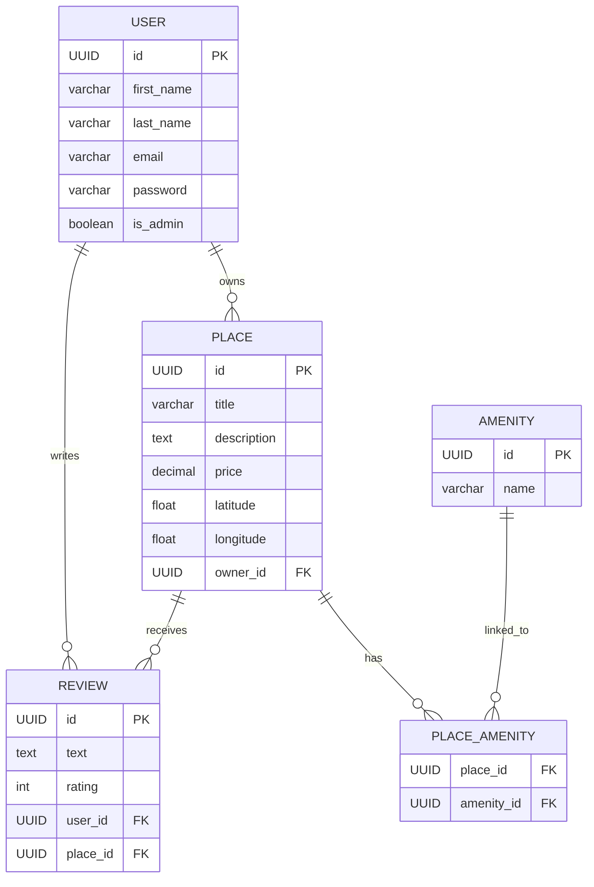
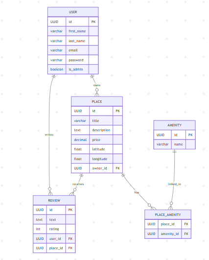
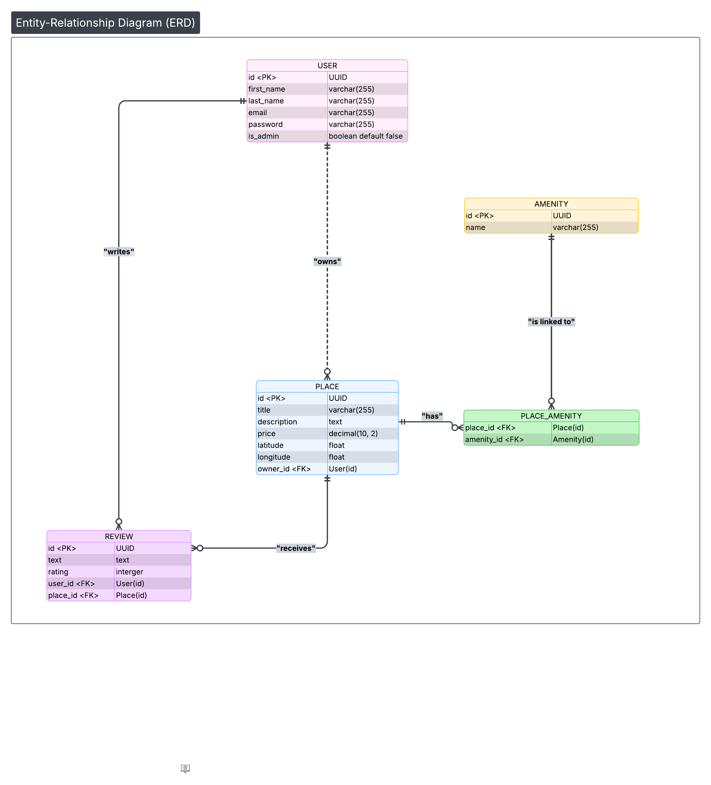
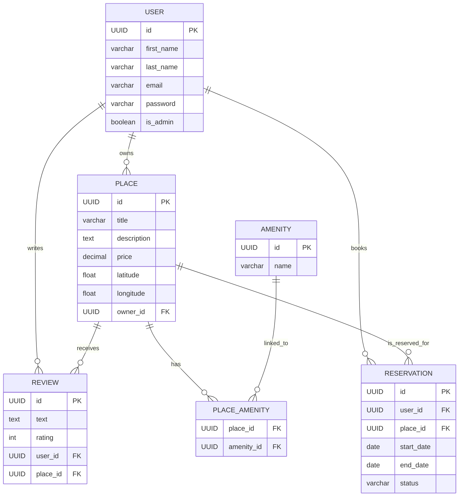
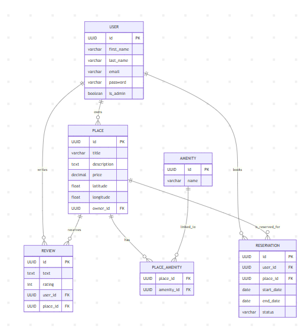

# HBnB Project presented by Tommy JOUHANS and James ROUSSEL

## Enhanced Backend with Authentication and Database Integration

**Overview**

In this third phase of the HBnB project, the backend was significantly improved by introducing secure authentication mechanisms, database persistence, and a scalable architecture that follows industry standards.

In previous parts of the project, the system relied on in-memory storage, which was useful for rapid prototyping but unsuitable for production environments. In this phase, the application was redesigned to support persistent storage using SQLAlchemy with SQLite for development and MySQL for production, as well as secure user authentication using JSON Web Tokens (JWT).

The main objective of this phase was to transform the backend into a secure, scalable, and production-ready REST API capable of managing users, places, reviews, and amenities while enforcing proper access control rules.

The project also introduces:

- Role-Based Access Control (RBAC) using the is_admin attribute

- Password hashing with bcrypt

- JWT-based authentication

- Database ORM mapping with SQLAlchemy

- Repository pattern for database operations

- ER diagrams and SQL schema scripts

---
## Project Directory Structure
```shell
hbnb/
│
├── run.py
├── config.py
├── requirements.txt
│
├── app/
│   ├── __init__.py
│   ├── api/
│   │   └── v1/
│   │       ├── auth.py
│   │       ├── users.py
│   │       ├── places.py
│   │       ├── reviews.py
│   │       └── amenities.py
│   │
│   ├── models/
│   │   ├── base_model.py
│   │   ├── user.py
│   │   ├── place.py
│   │   ├── review.py
│   │   └── amenity.py
│   │
│   ├── persistence/
│   │   ├── repository.py
│   │   └── sqlalchemy_repository.py
│   │
│   └── services/
│       └── facade.py
│
├── sql/
│   ├── schema.sql
│   └── seed.sql
│
└── tests/

```


## Project Architecture

The backend follows a layered architecture that separates concerns across different components.



**Each layer plays a specific role:**

- API Layer handles HTTP requests and responses.

- Service Layer (Facade) contains business logic.

- Repository Layer abstracts database access.

- ORM Layer (SQLAlchemy) maps Python models to database tables.

- Database Layer stores persistent data.

---

### Task 0/ Modify the Application Factory to Include the Configuration

**Objective**

The application factory pattern allows the application to be created dynamically with different configurations. 

This makes it easier to support multiple environments such as development, testing, and production.


**Implementation**

The create_app() function was modified to accept a configuration class and initialize the extensions required by the application.
---
```python
def create_app(config_class=DevelopmentConfig):

    app = Flask(__name__)
    app.config.from_object(config_class)

    db.init_app(app)
    jwt.init_app(app)
    bcrypt.init_app(app)

    from app.api.v1 import api_v1
    app.register_blueprint(api_v1, url_prefix="/api/v1")

    return app

```
**Key Components Initialized**

|Component	|Purpose     |
|-------|----------------|
|SQLAlchemy	|ORM for database interactions|
|JWTManager	|Authentication with JWT|
|Bcrypt	|Password hashing|

#  Installation & Setup

### 1️/ Clone the repository

Bash:
```shell
- git clone <repository_url>
- cd part3
```

### 2️/ Create a virtual environment (recommended)
```shell
- python3 -m venv venv
- source venv/bin/activate
```

### 3️/ Install dependencies
```shell
- pip install -r requirements.txt
```

**Dependencies:**
- Flask==3.1.2
- Flask-Bcrypt==1.0.1
- Flask-RESTful==0.3.10
- flask-restx==1.3.2
- Flask-SQLAlchemy==3.1.1
- Flask-JWT-Extended==4.7.1
- SQLAlchemy==2.0.48
- PyJWT==2.11.0
- pytest==9.0.2


**Running the Application**
```shell
- python -m hbnb.run
```

### Task 1/ Modify the User Model to Include Password Hashing

**Objective**

The user model was updated to securely store passwords using bcrypt hashing instead of storing plain-text passwords.

This ensures that even if the database is compromised, user passwords cannot be easily recovered.

**Implementation**

Two methods were added to the User model:


**Password Hashing**

```python
def hash_password(self, password):
    self.password = bcrypt.generate_password_hash(password).decode("utf-8")
```

**Password Verification**

```python
def verify_password(self, password):
    return bcrypt.check_password_hash(self.password, password)
```

**Security Improvements**

- Passwords are never stored in plain text

- Passwords are never returned in API responses

- Authentication relies on password verification rather than comparison

---
### Task 2/ Implement JWT Authentication with `flask-jwt-extended`
**Objective**

JWT authentication allows the API to securely authenticate users without maintaining server-side sessions.

Once a user logs in successfully, the server generates 
a JWT token that the client must include in future requests.

*Login Endpoint*

POST /api/v1/auth/login

*Implementation*

```python
@api.route('/login')
class Login(Resource):

    def post(self):

        credentials = api.payload
        user = facade.get_user_by_email(credentials["email"])

        if not user or not user.verify_password(credentials["password"]):
            return {"error": "Invalid credentials"}, 401

        access_token = create_access_token(
            identity=str(user.id),
            additional_claims={"is_admin": user.is_admin}
        )

        return {"access_token": access_token}, 200
```
**JWT Workflow**

- User sends login request with email and password

- Server validates credentials

- Server generates JWT token

- Client stores token

- Token is sent with each protected request

Example:

*Authorization: Bearer JWT_TOKEN*

---
### Task 3/ Implement Authenticated User Access Endpoints

*Objective*

Certain API operations must only be accessible by authenticated users.

The following endpoints require a valid JWT:

- Create a place

- Update a place

- Create a review

- Update a review

- Delete a review

- Update user profile


**Example Implementation**
```python
@jwt_required()
def post(self):

    current_user = get_jwt_identity()

    data = api.payload
    data["owner_id"] = current_user

    place = facade.create_place(data)

    return place.to_dict(), 201
```

**Ownership Validation**

Users cannot modify resources that they do not own.

Example:
```python
if place.owner_id != current_user:
    return {"error": "Unauthorized action"}, 403
```


---
### Task 4/ Implement Administrator Access Endpoints

**Objective**

- Administrators have higher privileges and can manage system resources.

- Admin-only actions include:

- Creating users

- Modifying user accounts

- Adding amenities

- Updating amenities

**Admin Check Implementation**

```python
claims = get_jwt()

if not claims.get("is_admin"):
    return {"error": "Admin privileges required"}, 403
```

**Example Admin Endpoint**
*POST /api/v1/amenities*

Only administrators can perform this operation.

---
### Task 5/ Implement SQLAlchemy Repository

**Objective**

The repository pattern separates database operations from business logic.

This improves maintainability and makes the system easier to test.

**Repository Implementation**


---
### Task 6/ Map the User Entity to SQLAlchemy Model

---
### Task 7/ Map the Place, Review, and Amenity Entities

---
### Task 8/ Map Relationships Between Entities Using SQLAlchemy


---
### Task 9/ SQL Scripts for Table Generation and Initial Data

---
### Task 10/ Generate Database Diagrams

*The database schema is represented using Mermaid ER diagrams.*

**Generate code: ER diagram with Mermaid:**




**ER diagram with Mermaid:**



**ER diagram with Lucid:**



** Generate code: ER diagram and new entity: Reservations  with Mermaid:**


**ER diagram and new entity: Reservations  with Mermaid:**



### API Testing
Create User
POST /api/v1/users
Login
POST /api/v1/auth/login

Example:
```shell
curl -X POST http://localhost:5000/api/v1/auth/login \
-H "Content-Type: application/json" \
-d '{"email":"admin@hbnb.io","password":"admin1234"}'
```

### Database Initialization
```shell
mysql -u root -p < sql/schema.sql
mysql -u root -p hbnb < sql/seed.sql
```


## Conclusion

This phase of the HBnB project transforms the backend into a secure and scalable system by integrating:

- JWT authentication

- Role-based access control

- SQLAlchemy ORM

- Repository design pattern

- SQL database schema

- ER database diagrams

The final system now supports secure authentication, 
persistent storage,
and structured data relationships, 
making it suitable for real-world application deployment.

---
## Authors

**- Tommy JOUHANS**

**- James ROUSSEL**


**Holberton School – Dijon, FRANCE**