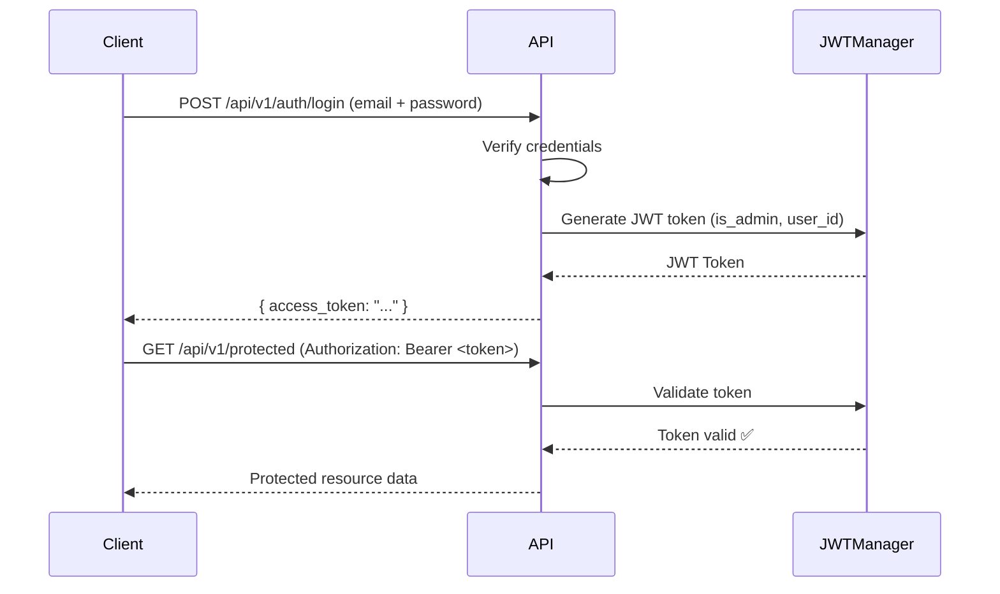
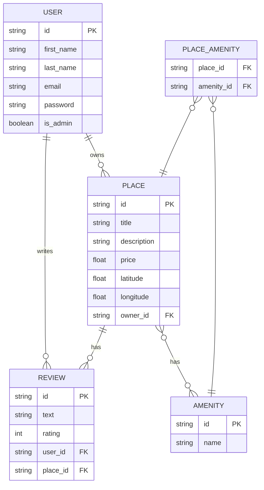
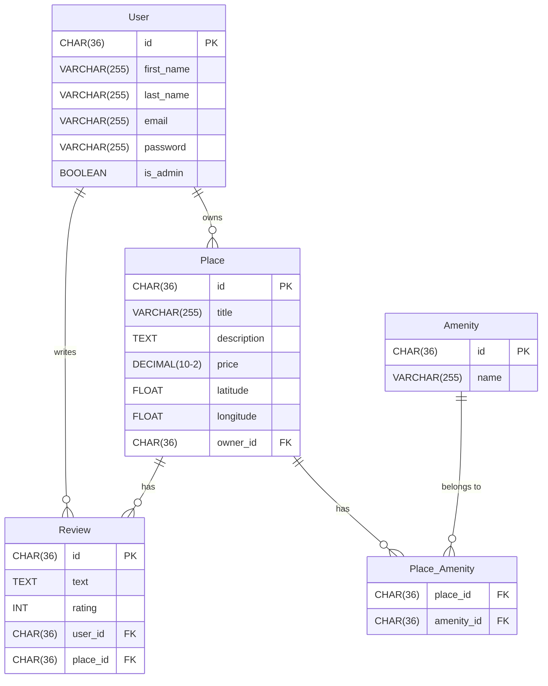
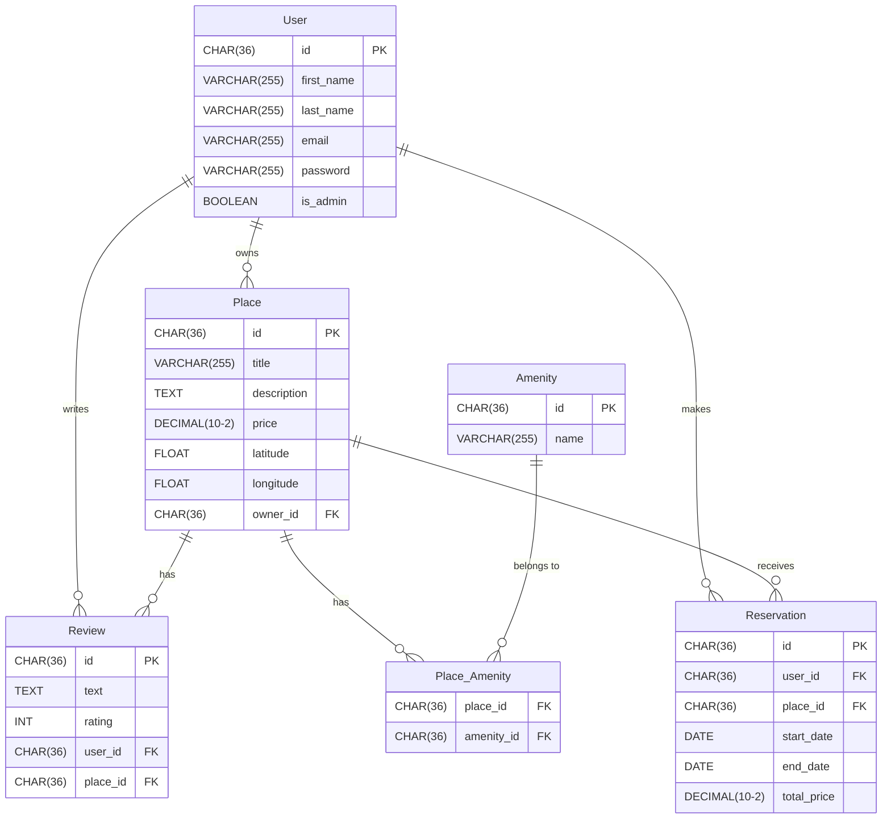

# HBnb Part 3: Part 3: Enhanced Backend with Authentication and Database Integration
### Authors: Tommy Jouhans & James Roussel
---

## Table of Contents

- [Project Overview](#project-overview)
- [Project Structure](#project-structure)
- [Task 0 - Application Factory Configuration](#task-0---application-factory-configuration)
- [Task 1 - Password Hashing with bcrypt](#task-1---password-hashing-with-bcrypt)
- [Task 2 - JWT Authentication](#task-2---jwt-authentication)
- [Task 3 - Authenticated User Access](#task-3---authenticated-user-access)
- [Task 4 - Administrator Access](#task-4---administrator-access)
- [Task 5 - SQLAlchemy Repository](#task-5---sqlalchemy-repository)
- [Task 6 - Map User Entity](#task-6---map-user-entity)
- [Task 7 - Map Place, Review, Amenity Entities](#task-7---map-place-review-and-amenity-entities)
- [Task 8 - Map Relationships Between Entities](#task-8---map-relationships-between-entities)
- [Task 9 - SQL Scripts](#task-9---sql-scripts)
- [Task 10 - ER Diagram](#task-10---er-diagram)
- [Setup & Installation](#setup--installation)
- [Running the Application](#running-the-application)

---

## Project Overview

HBnB Part 3 extends the REST API built in previous parts by introducing:
- **SQLAlchemy** for database persistence (replacing in-memory storage)
- **JWT authentication** via `flask-jwt-extended`
- **bcrypt password hashing** via `flask-bcrypt`
- **Role-based access control** (admin vs regular users)
- **Full relational database** schema with one-to-many and many-to-many relationships

---

## Project Structure

```
part3/
├── hbnb/
│   ├── app/
│   │   ├── __init__.py          # Application factory
│   │   ├── utils.py             # Password hashing utilities
│   │   ├── api/
│   │   │   └── v1/
│   │   │       ├── auth.py      # JWT login endpoint
│   │   │       ├── users.py     # User endpoints
│   │   │       ├── places.py    # Place endpoints
│   │   │       ├── reviews.py   # Review endpoints
│   │   │       └── amenities.py # Amenity endpoints
│   │   ├── models/
│   │   │   ├── base_model.py    # SQLAlchemy BaseModel
│   │   │   ├── user.py          # User model
│   │   │   ├── place.py         # Place model
│   │   │   ├── review.py        # Review model
│   │   │   ├── amenity.py       # Amenity model
│   │   │   └── place_amenity.py # Association table
│   │   ├── persistence/
│   │   │   └── repository.py    # InMemory & SQLAlchemy repositories
│   │   └── services/
│   │       └── facade.py        # Business logic facade
|   |__ config.py                # Configuration classes
│   └── run.py                   # Entry point
|   |__ initial_data.sql         # Initialize databases SQL
|   |__ schema.sql               # Create Table of databases
|
├── instance/
│   └── development.db           # SQLite database
└── README.md
```

---

## UML Diagrams

### Package Diagram (Task 0)

This diagram shows:
- the three architectural layers,
- the direction of data flow,
- the central position of the Facade.


---


---

## Task 0 - Application Factory Configuration

**Objective:** Update the Flask Application Factory to accept a configuration object.

The `create_app()` function in `app/__init__.py` receives a configuration class and applies it to the Flask instance.

```python
# hbnb/config.py
import os

class Config:
    """Base configuration class."""
    SECRET_KEY = os.getenv('SECRET_KEY', 'dev-secret-key-change-in-production')
    JWT_SECRET_KEY = os.getenv('JWT_SECRET_KEY', 'jwt-secret-key-change-in-production')
    JWT_ACCESS_TOKEN_EXPIRES = timedelta(days=30)
    DEBUG = False
    SQLALCHEMY_TRACK_MODIFICATIONS = False


class DevelopmentConfig(Config):
    """Development configuration."""
    DEBUG = True
    SQLALCHEMY_DATABASE_URI = 'sqlite:///development.db'

class TestingConfig(Config):
    TESTING = True
    SQLALCHEMY_DATABASE_URI = 'sqlite:///development.db'
    JWT_SECRET_KEY = 'test-secret'

config = {
    'development': DevelopmentConfig,
    'default': DevelopmentConfig,
    'testing': TestingConfig,
}

```

```python
# hbnb/app/__init__.py
def create_app(config_class=None):
    if config_class is None:
        config_class = DevelopmentConfig
    app = Flask(__name__)
    app.config.from_object(config_class)
    # ...
    return app
```

```python
# hbnb/run.py
from hbnb.app import create_app
from hbnb.app.config import DevelopmentConfig

app = create_app('development')

if __name__ == '__main__':
    app.run(debug=True)
```

---

## Task 1 - Password Hashing with bcrypt

**Objective:** Securely hash and store user passwords using bcrypt.

### Installation

```bash
pip install flask-bcrypt
```

### Implementation

```python
# app/__init__.py
from flask_bcrypt import Bcrypt
bcrypt = Bcrypt()

def create_app(config_class=None):
    # ...
    bcrypt.init_app(app)
```

```python
# models/user.py
def hash_password(self, password):
    self.password = bcrypt.generate_password_hash(password).decode('utf-8')

def verify_password(self, password):
    return bcrypt.check_password_hash(self.password, password)
```

### Test - The POST endpoint /users/ requires an admin token. Log in first:

```bash
TOKEN=$(curl -s -X POST http://127.0.0.1:5000/api/v1/auth/login \
  -H "Content-Type: application/json" \
  -d '{"email":"admin@hbnb.io","password":"admin1234"}' | python3 -c "import sys,json; print(json.load(sys.stdin)['access_token'])")
```


### Test - Create User (password hashed, not returned)

```bash
curl -X POST "http://127.0.0.1:5000/api/v1/users/" \
  -H "Content-Type: application/json" \
  -H "Authorization: Bearer $TOKEN" \
  -d '{"first_name": "John", "last_name": "Doe", "email": "john@example.com", "password": "pass123"}'
```

**Expected Response:**
```json
{
    "id": "3597e65d-068e-43ae-8229-b011d4cb532e",
    "message": "User successfully created"
}
```

### Test - Get User (password not exposed)

```bash
curl -X GET "http://127.0.0.1:5000/api/v1/users/3597e65d-068e-43ae-8229-b011d4cb532e"
```

**Expected Response:**
```json
{
    "id": "3597e65d-068e-43ae-8229-b011d4cb532e",
    "first_name": "John",
    "last_name": "Doe",
    "email": "john@example.com",
    "is_admin": false
}
```

---

## Task 2 - JWT Authentication

**Objective:** Implement JWT-based login using `flask-jwt-extended`.

### JWT Flow Diagram



### Installation

```bash
pip install flask-jwt-extended
```

### Implementation

```python
# app/__init__.py
from flask_jwt_extended import JWTManager
jwt = JWTManager()

def create_app(config_class=None):
    # ...
    jwt.init_app(app)
```

### Test - Login

```bash
curl -X POST "http://127.0.0.1:5000/api/v1/auth/login" \
  -H "Content-Type: application/json" \
  -d '{"email":"admin@hbnb.io","password":"admin1234"}'
```

**Expected Response:**
```json
{
    "access_token": "eyJhbGciOiJIUzI1NiIsInR5cCI6IkpXVCJ9..."
}
```

### Test - Access Protected Endpoint

```bash
curl -X GET "http://127.0.0.1:5000/api/v1/users/" \
  -H "Authorization: Bearer <your_token>"
```

### Test - Invalid / Expired Token

```json
{
    "msg": "Token has expired"
}
```

---

## Task 3 - Authenticated User Access

**Objective:** Secure endpoints with JWT, add ownership validation.

### Protected Endpoints

| Method | Endpoint | Description |
|--------|----------|-------------|
| POST | `/api/v1/places/` | Create a place (authenticated) |
| PUT | `/api/v1/places/<id>` | Update own place only |
| POST | `/api/v1/reviews/` | Create review (not own place, once per place) |
| PUT | `/api/v1/reviews/<id>` | Update own review only |
| DELETE | `/api/v1/reviews/<id>` | Delete own review only |
| PUT | `/api/v1/users/<id>` | Update own profile (no email/password) |

### Public Endpoints

| Method | Endpoint | Description |
|--------|----------|-------------|
| GET | `/api/v1/places/` | List all places |
| GET | `/api/v1/places/<id>` | Get place details |

### Test - Unauthorized Place Update

```bash
curl -X PUT "http://127.0.0.1:5000/api/v1/places/86b561aa-b69a-4b8e-974b-b1b508e8aa35" \
  -H "Content-Type: application/json" \
  -H "Authorization: Bearer <other_user_token>" \
  -d '{"title": "Hacked title"}'
```

**Expected Response:**
```json
{
    "error": "Unauthorized action"
}
```

### Test - Update Own Review

```bash
curl -X PUT "http://127.0.0.1:5000/api/v1/reviews/7d5a9f01-f662-4d30-9d63-97c6e775d612" \
  -H "Content-Type: application/json" \
  -H "Authorization: Bearer <admin_token>" \
  -d '{"text": "Updated review", "rating": 4}'
```

### Test - Public Places (no token needed)

```bash
curl -X GET "http://127.0.0.1:5000/api/v1/places/"
```

**Expected Response:**
```json
[
    {
        "id": "86b561aa-b69a-4b8e-974b-b1b508e8aa35",
        "title": "Maison de John",
        "price": 80.0
    }
]
```

### Test - Modify Own User Info (no email/password)

```bash
curl -X PUT "http://127.0.0.1:5000/api/v1/users/3597e65d-068e-43ae-8229-b011d4cb532e" \
  -H "Content-Type: application/json" \
  -H "Authorization: Bearer <john_token>" \
  -d '{"first_name": "Johnny"}'
```

### Test - Try to Modify Email (blocked)

```bash
curl -X PUT "http://127.0.0.1:5000/api/v1/users/3597e65d-068e-43ae-8229-b011d4cb532e" \
  -H "Content-Type: application/json" \
  -H "Authorization: Bearer <john_token>" \
  -d '{"email": "newemail@test.com"}'
```

**Expected Response:**
```json
{
    "error": "You cannot modify email or password"
}
```

---

## Task 4 - Administrator Access

**Objective:** Allow admins to bypass ownership restrictions and manage all resources.

### Admin-Only Endpoints

| Method | Endpoint | Description |
|--------|----------|-------------|
| POST | `/api/v1/users/` | Create any user |
| PUT | `/api/v1/users/<id>` | Modify any user (incl. email/password) |
| POST | `/api/v1/amenities/` | Create amenity |
| PUT | `/api/v1/amenities/<id>` | Modify amenity |

### RBAC Check Pattern

```python
from flask_jwt_extended import get_jwt

@api.route('/<amenity_id>')
class AmenityResource(Resource):
    @jwt_required()
    def put(self, amenity_id):
        current_user = get_jwt()
        if not current_user.get('is_admin'):
            return {'error': 'Admin privileges required'}, 403
        # update logic...
```

### Test - Create User as Admin

```bash
curl -X POST "http://127.0.0.1:5000/api/v1/users/" \
  -H "Content-Type: application/json" \
  -H "Authorization: Bearer <admin_token>" \
  -d '{"first_name": "Jane", "last_name": "Smith", "email": "jane@test.com", "password": "pass123"}'
```

### Test - Add Amenity as Admin

```bash
curl -X POST "http://127.0.0.1:5000/api/v1/amenities/" \
  -H "Content-Type: application/json" \
  -H "Authorization: Bearer <admin_token>" \
  -d '{"name": "Swimming Pool"}'
```

### Test - Non-admin Tries to Create Amenity

```bash
curl -X POST "http://127.0.0.1:5000/api/v1/amenities/" \
  -H "Content-Type: application/json" \
  -H "Authorization: Bearer <john_token>" \
  -d '{"name": "Sauna"}'
```

**Expected Response:**
```json
{
    "error": "Admin privileges required"
}
```

### Test - Admin Modifies Another User's Place

```bash
curl -X PUT "http://127.0.0.1:5000/api/v1/places/86b561aa-b69a-4b8e-974b-b1b508e8aa35" \
  -H "Content-Type: application/json" \
  -H "Authorization: Bearer <admin_token>" \
  -d '{"title": "Admin Updated Title"}'
```


---

## Task 5 - SQLAlchemy Repository

**Objective:** Replace the in-memory repository with a SQLAlchemy-based repository.

### Switch between repositories

```bash
# Use SQLAlchemy (recommended)
export USE_DATABASE=true && python -m hbnb.run

# Use InMemory (default)
python -m hbnb.run
```

### Repository Interface

```python
# persistence/repository.py
class SQLAlchemyRepository(Repository):
    def __init__(self, model):
        self.model = model

    def add(self, obj):
        from hbnb.app import db
        db.session.add(obj)
        db.session.commit()

    def get(self, obj_id):
        from hbnb.app import db
        return db.session.get(self.model, obj_id)

    def get_all(self):
        return self.model.query.all()

    def update(self, obj_id, data):
        from hbnb.app import db
        obj = self.get(obj_id)
        if obj:
            for key, value in data.items():
                setattr(obj, key, value)
            db.session.commit()
            return obj
        return None

    def delete(self, obj_id):
        from hbnb.app import db
        obj = self.get(obj_id)
        if obj:
            db.session.delete(obj)
            db.session.commit()

    def get_by_attribute(self, attr_name, attr_value):
        return self.model.query.filter_by(**{attr_name: attr_value}).first()
```

### Facade Selection Logic

```python
# services/facade.py
USE_DATABASE = os.getenv('USE_DATABASE', 'false').lower() == 'true'

if USE_DATABASE:
    print("Using SQLAlchemy Repository")
else:
    print("Using InMemory Repository")
```


---

## Task 6 - Map User Entity

**Objective:** Map the User entity to a SQLAlchemy model.

### BaseModel

```python
# models/base_model.py
from hbnb.app import db
import uuid
from datetime import datetime

class BaseModel(db.Model):
    __abstract__ = True

    id = db.Column(db.String(36), primary_key=True, default=lambda: str(uuid.uuid4()))
    created_at = db.Column(db.DateTime, default=datetime.utcnow, nullable=False)
    updated_at = db.Column(db.DateTime, default=datetime.utcnow, onupdate=datetime.utcnow, nullable=False)
```

### User Model

```python
# models/user.py
class User(BaseModel, db.Model):
    __tablename__ = "users"

    first_name = db.Column(db.String(50), nullable=False)
    last_name  = db.Column(db.String(50), nullable=False)
    email      = db.Column(db.String(120), unique=True, nullable=False, index=True)
    password   = db.Column(db.String(255), nullable=False)
    is_admin   = db.Column(db.Boolean, default=False)
```


### Test - Create User

```bash
curl -X POST "http://127.0.0.1:5000/api/v1/users/" \
  -H "Content-Type: application/json" \
  -H "Authorization: Bearer <admin_token>" \
  -d '{"first_name": "John", "last_name": "Doe", "email": "john@test.com", "password": "pass123"}'
```

**Expected Response:**
```json
{
    "id": "3597e65d-068e-43ae-8229-b011d4cb532e",
    "message": "User successfully created"
}
```

---

## Task 7 - Map Place, Review, and Amenity Entities

**Objective:** Map the remaining entities to SQLAlchemy models.

### Place Model

```python
class Place(BaseModel, db.Model):
    __tablename__ = 'places'

    title           = db.Column(db.String(100), nullable=False)
    description     = db.Column(db.Text, nullable=True)
    price           = db.Column(db.Float, nullable=False)
    latitude        = db.Column(db.Float, nullable=False)
    longitude       = db.Column(db.Float, nullable=False)
    owner_id = db.Column(db.String(36), db.ForeignKey('users.id', ondelete='CASCADE'),
                         nullable=False)
    amenities_id = db.Column(db.String(36), db.ForeignKey('amenities.id', ondelete='CASCADE'),
                         nullable=False)
    reviews_id = db.Column(db.String(36), db.ForeignKey('reviews.id', ondelete='CASCADE'),
                         nullable=False)

```

### Review Model

```python
class Review(BaseModel, db.Model):
    __tablename__ = 'reviews'

    text   = db.Column(db.Text, nullable=False)
    rating = db.Column(db.Integer, nullable=False)
```

### Amenity Model

```python
class Amenity(BaseModel, db.Model):
    __tablename__ = 'amenities'

    name = db.Column(db.String(100), nullable=False, unique=True)
```

### Test - Create Place

```bash
curl -X POST "http://127.0.0.1:5000/api/v1/places/" \
  -H "Content-Type: application/json" \
  -H "Authorization: Bearer <token>" \
  -d '{"title": "Maison de John", "description": "Belle vue sur la mer", "price": 80, "latitude": 43.3, "longitude": 5.4}'
```

**Expected Response:**
```json
{
    "id": "86b561aa-b69a-4b8e-974b-b1b508e8aa35",
    "title": "Maison de John",
    "description": "Belle vue sur la mer",
    "price": 80.0,
    "latitude": 43.3,
    "longitude": 5.4,
    "owner_id": "3597e65d-068e-43ae-8229-b011d4cb532e"
}
```

### Test - Create Amenity

```bash
curl -X POST "http://127.0.0.1:5000/api/v1/amenities/" \
  -H "Content-Type: application/json" \
  -H "Authorization: Bearer <token>" \
  -d '{"name": "WiFi"}'
```

**Expected Response:**
```json
{
    "id": "168750ed-bb58-4b67-973a-ad0c1a548682",
    "name": "WiFi",
    "created_at": "2026-03-09T14:50:00.951063",
    "updated_at": "2026-03-09T14:50:00.951070"
}
```

### Test - Add Amenity in place

```bash
curl -X POST "http://127.0.0.1:5000/api/v1/amenities/" \
  -H "Content-Type: application/json" \
  -H "Authorization: Bearer <token>" \
  -d '{"name": "WiFi"}'
```

**Expected Response:**
```json
{
    "message": "Amenity added to place successfully"
}
```
---

### Initialize Database

```bash
export USE_DATABASE=true
export FLASK_APP=hbnb.app
flask shell
>>> from hbnb.app import db
>>> from hbnb.app.models import User, Place, Review, Amenity
>>> db.create_all()
>>> exit()
```

## Task 8 - Map Relationships Between Entities

**Objective:** Define one-to-many and many-to-many relationships using SQLAlchemy.

### Relationships Diagram




### Implementation

```python
# models/__init__.py
place_amenity = db.Table(
    'place_amenity',
    db.Column('place_id', db.String(36), db.ForeignKey('places.id', ondelete='CASCADE'), primary_key=True),
    db.Column('amenity_id', db.String(36), db.ForeignKey('amenities.id', ondelete='CASCADE'), primary_key=True)
)
```

```python
# In User model
places  = db.relationship('Place', back_populates='owner', cascade='all, delete-orphan')
reviews = db.relationship('Review', back_populates='user', cascade='all, delete-orphan')

# In Place model
owner_id = db.Column(db.String(36), db.ForeignKey('users.id'), nullable=False)
owner    = db.relationship('User', back_populates='places')
reviews  = db.relationship('Review', back_populates='place', cascade='all, delete-orphan')
amenities = db.relationship('Amenity', secondary='place_amenity', back_populates='places')

# In Review model
user_id  = db.Column(db.String(36), db.ForeignKey('users.id'), nullable=False)
place_id = db.Column(db.String(36), db.ForeignKey('places.id'), nullable=False)
```

### Test - Link Amenity to Place

```bash
curl -X POST "http://127.0.0.1:5000/api/v1/places/86b561aa-b69a-4b8e-974b-b1b508e8aa35/amenities/168750ed-bb58-4b67-973a-ad0c1a548682" \
  -H "Authorization: Bearer <token>"
```

**Expected Response:**
```json
{
    "message": "Amenity added to place successfully"
}
```

### Test - Get Place Amenities

```bash
curl -X GET "http://127.0.0.1:5000/api/v1/places/86b561aa-b69a-4b8e-974b-b1b508e8aa35/amenities" \
  -H "Authorization: Bearer <token>"
```

**Expected Response:**
```json
[
    {
        "id": "168750ed-bb58-4b67-973a-ad0c1a548682",
        "name": "WiFi",
        "created_at": "2026-03-09T14:50:00.951063",
        "updated_at": "2026-03-09T14:50:00.951070"
    }
]
```

### Test - Create Review (different user)

```bash
curl -X POST "http://127.0.0.1:5000/api/v1/reviews/" \
  -H "Content-Type: application/json" \
  -H "Authorization: Bearer <admin_token>" \
  -d '{"text": "Excellent séjour!", "rating": 5, "place_id": "86b561aa-b69a-4b8e-974b-b1b508e8aa35", "user_id": "3debbf35-bbd2-4bc0-acfc-d3c1962aedb3"}'
```

**Expected Response:**
```json
{
    "id": "7d5a9f01-f662-4d30-9d63-97c6e775d612",
    "text": "Excellent séjour!",
    "rating": 5,
    "user_id": "3debbf35-bbd2-4bc0-acfc-d3c1962aedb3",
    "place_id": "86b561aa-b69a-4b8e-974b-b1b508e8aa35"
}
```

### Test - Get Place Reviews

```bash
curl -X GET "http://127.0.0.1:5000/api/v1/places/86b561aa-b69a-4b8e-974b-b1b508e8aa35/reviews" \
  -H "Authorization: Bearer <token>"
```

**Expected Response:**
```json
[
    {
        "id": "7d5a9f01-f662-4d30-9d63-97c6e775d612",
        "text": "Excellent séjour!",
        "rating": 5,
        "user_id": "3debbf35-bbd2-4bc0-acfc-d3c1962aedb3",
        "place_id": "86b561aa-b69a-4b8e-974b-b1b508e8aa35"
    }
]
```

### Test - Cannot Review Own Place (Business Rule)

```bash
curl -X POST "http://127.0.0.1:5000/api/v1/reviews/" \
  -H "Content-Type: application/json" \
  -H "Authorization: Bearer <john_token>" \
  -d '{"text": "My own place!", "rating": 5, "place_id": "86b561aa-b69a-4b8e-974b-b1b508e8aa35", "user_id": "3597e65d-068e-43ae-8229-b011d4cb532e"}'
```

**Expected Response:**
```json
{
    "error": "You cannot review your own place"
}
```

---


## Task 9 - SQL Scripts

**Objective:** Generate SQL scripts for table creation and initial data.

### Table Creation - schema.sql 

```sql

CREATE TABLE IF NOT EXISTS users (
    id         CHAR(36) PRIMARY KEY,
    first_name VARCHAR(255) NOT NULL,
    last_name  VARCHAR(255) NOT NULL,
    email      VARCHAR(255) UNIQUE NOT NULL,
    password   VARCHAR(255) NOT NULL,
    is_admin   BOOLEAN DEFAULT FALSE
);

CREATE TABLE IF NOT EXISTS places (
    id          CHAR(36) PRIMARY KEY,
    title       VARCHAR(255) NOT NULL,
    description TEXT,
    price       DECIMAL(10, 2),
    latitude    FLOAT,
    longitude   FLOAT,
    owner_id    CHAR(36) NOT NULL,
    FOREIGN KEY (owner_id) REFERENCES User(id)
);

CREATE TABLE IF NOT EXISTS amenities (
    id   CHAR(36) PRIMARY KEY,
    name VARCHAR(255) UNIQUE NOT NULL
);

CREATE TABLE IF NOT EXISTS reviews (
    id       CHAR(36) PRIMARY KEY,
    text     TEXT NOT NULL,
    rating   INT CHECK (rating BETWEEN 1 AND 5),
    user_id  CHAR(36) NOT NULL,
    place_id CHAR(36) NOT NULL,
    FOREIGN KEY (user_id)  REFERENCES User(id),
    FOREIGN KEY (place_id) REFERENCES Place(id),
    UNIQUE (user_id, place_id)
);

CREATE TABLE place_amenity (
    place_id   VARCHAR(36) NOT NULL,
    amenity_id VARCHAR(36) NOT NULL,
    PRIMARY KEY (place_id, amenity_id),
    FOREIGN KEY (place_id)   REFERENCES places(id)   ON DELETE CASCADE,
    FOREIGN KEY (amenity_id) REFERENCES amenities(id) ON DELETE CASCADE
);


```

### Initial Data

```sql

-- Admin user
INSERT INTO users (id, first_name, last_name, email, password, is_admin, created_at, updated_at)
VALUES (
    '36c9050e-ddd3-4c3b-9731-9f487208bbc1',
    'Admin', 'HBnB', 'admin@hbnb.io',
    '${HASH}',
    1,
    datetime('now'), datetime('now')
);

-- Amenities
INSERT INTO amenities (id, name, created_at, updated_at) VALUES
    ('$(python3 -c "import uuid; print(uuid.uuid4())")', 'WiFi',            datetime('now'), datetime('now')),
    ('$(python3 -c "import uuid; print(uuid.uuid4())")', 'Piscine',         datetime('now'), datetime('now')),
    ('$(python3 -c "import uuid; print(uuid.uuid4())")', 'Climatisation',   datetime('now'), datetime('now'));

```

---

## Task 10 - ER Diagram

**Objective:** Visual representation of the full database schema.


**ER diagram generated:**


- USER owns PLACE — a user can own multiple places, a place has a single owner.

- USER writes REVIEW — a user can write multiple reviews.
 - PLACE has REVIEW — a place can have multiple reviews, a review belongs to a single place.
- PLACE ↔ AMENITY — Many-to-Many relationship. A place can have multiple amenities, an amenity can be in multiple places. 

- The PLACE_AMENITY table links the two — it contains only place_id and amenity_id.
---

*If we can to add Reservation entity:*




The known relationships are the same: USER owns PLACE, writes REVIEW, PLACE and AMENITY are linked via PLACE_AMENITY.

The new element: the RESERVATION table
It is not in your current code but appears here as a possible extension. It contains a user_id, a place_id, a start date, an end date, and a total price. A user makes a reservation, a lodging receives a reservation.

Differences with the previous schema
The SQL types are specified (CHAR(36), VARCHAR(255), DECIMAL(10,2)…) and the RESERVATION table is added — this schema is therefore closer to raw SQL than to the current code implementation.

In summary: this is the complete planned database diagram, with the reservation added — a feature that is not yet coded in our project.

### Booking Model (SQLAlchemy)

```python
class Reservation(BaseModel, db.Model):
    __tablename__ = "Reservation"

    user_id     = Column(String(36), ForeignKey("users.id",  ondelete="CASCADE"), nullable=False)
    place_id    = Column(String(36), ForeignKey("places.id", ondelete="CASCADE"), nullable=False)
    start_date    = Column(Date,    nullable=False)
    end_date  = Column(Date,    nullable=False)
    total_price = Column(Numeric(10, 2), nullable=False)
    

    # passive_deletes=True: lets the DB ON DELETE CASCADE handle deletion
    # without SQLAlchemy attempting a SET NULL first
    user  = relationship("User",  backref=db.backref("bookings",
                cascade="all, delete-orphan", passive_deletes=True))
    place = relationship("Place", backref=db.backref("bookings",
                cascade="all, delete-orphan", passive_deletes=True))

    def nights(self):
        return (self.check_out - self.check_in).days
```


### Business Rules

- The owner of a Place **cannot** book their own place
- Status lifecycle: `pending` → `confirmed` → `cancelled`
- `total_price = price × nights()`
- **CASCADE DELETE**: deleting a `User` or `Place` removes all linked `Booking` records

---

## Unit Tests — Full Results

```bash
export USE_DATABASE=true
python -m unittest discover -s hbnb/tests -v
```

*Results of unit tests:*

```bash
(venv) tommy@TommyJOUHANSPRO:~/holbertonschool-hbnb/part3$ python -m unittest discover -s hbnb/tests -v
test_create_amenity_invalid (test_amenities.TestAmenityEndpoints.test_create_amenity_invalid)
Empty name should return 400. ... Using SQLAlchemy Repository
✅ Admin user already exists
/home/tommy/holbertonschool-hbnb/part3/hbnb/app/models/base_model.py:39: DeprecationWarning: datetime.datetime.utcnow() is deprecated and scheduled for removal in a future version. Use timezone-aware objects to represent datetimes in UTC: datetime.datetime.now(datetime.UTC).
  self.created_at = datetime.utcnow()
/home/tommy/holbertonschool-hbnb/part3/hbnb/app/models/base_model.py:41: DeprecationWarning: datetime.datetime.utcnow() is deprecated and scheduled for removal in a future version. Use timezone-aware objects to represent datetimes in UTC: datetime.datetime.now(datetime.UTC).
  self.updated_at = datetime.utcnow()
ok
test_create_amenity_no_token (test_amenities.TestAmenityEndpoints.test_create_amenity_no_token)
Without token should return 401. ... ✅ Admin user already exists
ok
test_create_amenity_non_admin (test_amenities.TestAmenityEndpoints.test_create_amenity_non_admin)
Non-admin user should get 403. ... ✅ Admin user already exists
ok
test_create_amenity_valid (test_amenities.TestAmenityEndpoints.test_create_amenity_valid)
Admin can create an amenity. ... ✅ Admin user already exists
ok
test_get_amenities (test_amenities.TestAmenityEndpoints.test_get_amenities)
GET /amenities/ is public and returns 200. ... ✅ Admin user already exists
ok
test_amenity_not_found (test_amenity_crud.TestAmenityCRUD.test_amenity_not_found)
GET /amenities/<fake-id> → 404. ... ✅ Admin user already exists
ok
test_create_amenity (test_amenity_crud.TestAmenityCRUD.test_create_amenity)
Admin creates amenity → 201. ... ✅ Admin user already exists
ok
test_create_amenity_no_token (test_amenity_crud.TestAmenityCRUD.test_create_amenity_no_token)
No token → 401. ... ✅ Admin user already exists
ok
test_get_all_amenities (test_amenity_crud.TestAmenityCRUD.test_get_all_amenities)
GET /amenities/ returns a list. ... ✅ Admin user already exists
ok
test_get_amenity (test_amenity_crud.TestAmenityCRUD.test_get_amenity)
GET /amenities/<id> returns correct amenity. ... ✅ Admin user already exists
ok
test_non_admin_cannot_create_amenity (test_amenity_crud.TestAmenityCRUD.test_non_admin_cannot_create_amenity)
Non-admin cannot create amenity → 403. ... ✅ Admin user already exists
ok
test_update_amenity (test_amenity_crud.TestAmenityCRUD.test_update_amenity)
Admin updates amenity → 200. ... ✅ Admin user already exists
/home/tommy/holbertonschool-hbnb/part3/hbnb/app/models/base_model.py:45: DeprecationWarning: datetime.datetime.utcnow() is deprecated and scheduled for removal in a future version. Use timezone-aware objects to represent datetimes in UTC: datetime.datetime.now(datetime.UTC).
  self.updated_at = datetime.utcnow()
ok
test_admin_token_has_admin_access (test_auth.TestAuth.test_admin_token_has_admin_access)
Admin token can create amenities. ... ✅ Admin user already exists
ok
test_invalid_token_rejected (test_auth.TestAuth.test_invalid_token_rejected)
Fake token on a JWT-protected route should return 401/422. ... ✅ Admin user already exists
ok
test_login_missing_password (test_auth.TestAuth.test_login_missing_password)
Missing password field should return 400 (validation error). ... ✅ Admin user already exists
ok
test_login_unknown_email (test_auth.TestAuth.test_login_unknown_email)
Unknown email should return 401. ... ✅ Admin user already exists
ok
test_login_valid (test_auth.TestAuth.test_login_valid)
Valid credentials return a JWT token. ... ✅ Admin user already exists
ok
test_login_wrong_password (test_auth.TestAuth.test_login_wrong_password)
Wrong password should return 401. ... ✅ Admin user already exists
ok
test_normal_user_token_denied_admin_route (test_auth.TestAuth.test_normal_user_token_denied_admin_route)
Normal user token cannot create amenities → 403. ... ✅ Admin user already exists
ok
test_protected_route_accessible_with_token (test_auth.TestAuth.test_protected_route_accessible_with_token)
Protected route accessible with valid token. ... ✅ Admin user already exists
ok
test_public_route_no_token_needed (test_auth.TestAuth.test_public_route_no_token_needed)
Public routes accessible without token. ... ✅ Admin user already exists
ok
test_token_required_on_protected_route (test_auth.TestAuth.test_token_required_on_protected_route)
Creating user without token returns 401. ... ✅ Admin user already exists
ok
test_add_amenity_to_place (test_entity_relationships.TestEntityRelationships.test_add_amenity_to_place)
Owner can add amenity to place → 200. ... ✅ Admin user already exists
ok
test_cannot_add_amenity_without_token (test_entity_relationships.TestEntityRelationships.test_cannot_add_amenity_without_token)
Adding amenity without token → 401. ... ✅ Admin user already exists
ok
test_non_owner_cannot_add_amenity (test_entity_relationships.TestEntityRelationships.test_non_owner_cannot_add_amenity)
Non-owner cannot add amenity to place → 403. ... ✅ Admin user already exists
ok
test_place_amenities_empty_initially (test_entity_relationships.TestEntityRelationships.test_place_amenities_empty_initially)
New place has no amenities. ... ✅ Admin user already exists
ok
test_place_amenity_visible_in_get (test_entity_relationships.TestEntityRelationships.test_place_amenity_visible_in_get)
Added amenity appears in GET /places/<id>/amenities. ... ✅ Admin user already exists
ok
test_place_has_owner_id (test_entity_relationships.TestEntityRelationships.test_place_has_owner_id)
Place response includes owner_id. ... ✅ Admin user already exists
ok
test_place_has_reviews (test_entity_relationships.TestEntityRelationships.test_place_has_reviews)
GET /places/<id>/reviews returns reviews for that place. ... ✅ Admin user already exists
ok
test_place_reviews_empty_initially (test_entity_relationships.TestEntityRelationships.test_place_reviews_empty_initially)
New place has no reviews. ... ✅ Admin user already exists
ok
test_remove_amenity_from_place (test_entity_relationships.TestEntityRelationships.test_remove_amenity_from_place)     
Owner can remove amenity from place → 200. ... ✅ Admin user already exists
ok
test_fake_token_rejected (test_jwt_authentication.TestJWTAuthentication.test_fake_token_rejected)
Fake JWT token → 401 or 422. ... ✅ Admin user already exists
ok
test_login_missing_password (test_jwt_authentication.TestJWTAuthentication.test_login_missing_password)
Missing password → 400 (Flask-RESTX validation). ... ✅ Admin user already exists
ok
test_login_returns_token (test_jwt_authentication.TestJWTAuthentication.test_login_returns_token)
Valid login returns access_token. ... ✅ Admin user already exists
ok
test_login_unknown_user (test_jwt_authentication.TestJWTAuthentication.test_login_unknown_user)
Unknown email → 401. ... ✅ Admin user already exists
ok
test_login_wrong_password (test_jwt_authentication.TestJWTAuthentication.test_login_wrong_password)
Wrong password → 401. ... ✅ Admin user already exists
ok
test_protected_endpoint_requires_token (test_jwt_authentication.TestJWTAuthentication.test_protected_endpoint_requires_token)
jwt_required() endpoint → 401 without token. ... ✅ Admin user already exists
ok
test_protected_route_with_valid_token (test_jwt_authentication.TestJWTAuthentication.test_protected_route_with_valid_token)
GET /auth/protected works with valid token. ... ✅ Admin user already exists
ok
test_public_routes_no_token_needed (test_jwt_authentication.TestJWTAuthentication.test_public_routes_no_token_needed) 
Public endpoints → 200 without token. ... ✅ Admin user already exists
ok
test_token_grants_admin_access (test_jwt_authentication.TestJWTAuthentication.test_token_grants_admin_access)
Admin token grants access to admin-only endpoints. ... ✅ Admin user already exists
ok
test_get_user_does_not_return_password (test_password_hashing.TestPasswordHashing.test_get_user_does_not_return_password)
GET /users/<id> must not return password field. ... ✅ Admin user already exists
ok
test_get_users_list_no_password (test_password_hashing.TestPasswordHashing.test_get_users_list_no_password)
GET /users/ must not expose password in any user. ... ✅ Admin user already exists
ok
test_login_validates_bcrypt_password (test_password_hashing.TestPasswordHashing.test_login_validates_bcrypt_password) 
Login endpoint correctly validates bcrypt-hashed password. ... ✅ Admin user already exists
ok
test_post_user_hashes_password (test_password_hashing.TestPasswordHashing.test_post_user_hashes_password)
POST /users/ stores hashed password, not plaintext. ... ✅ Admin user already exists
ok
test_verify_password_correct (test_password_hashing.TestPasswordHashing.test_verify_password_correct)
verify_password() returns True for correct password (via API). ... ✅ Admin user already exists
ok
test_verify_password_wrong (test_password_hashing.TestPasswordHashing.test_verify_password_wrong)
verify_password() returns False for wrong password. ... ✅ Admin user already exists
ok
test_add_amenity_no_token (test_place_amenity.TestPlaceAmenity.test_add_amenity_no_token)
Without token should return 401. ... ✅ Admin user already exists
ok
test_add_amenity_nonexistent_place (test_place_amenity.TestPlaceAmenity.test_add_amenity_nonexistent_place)
Adding amenity to a non-existent place should return 404. ... ✅ Admin user already exists
ok
test_add_amenity_to_place_as_admin (test_place_amenity.TestPlaceAmenity.test_add_amenity_to_place_as_admin)
Admin can add an amenity to any place. ... ✅ Admin user already exists
ok
test_add_amenity_to_place_as_owner (test_place_amenity.TestPlaceAmenity.test_add_amenity_to_place_as_owner)
Owner can add an amenity to their place. ... ✅ Admin user already exists
ok
test_add_amenity_wrong_user (test_place_amenity.TestPlaceAmenity.test_add_amenity_wrong_user)
Non-owner cannot add amenity to someone else's place. ... ✅ Admin user already exists
ok
test_add_nonexistent_amenity (test_place_amenity.TestPlaceAmenity.test_add_nonexistent_amenity)
Adding a non-existent amenity should return 404. ... ✅ Admin user already exists
ok
test_get_amenities_empty_place (test_place_amenity.TestPlaceAmenity.test_get_amenities_empty_place)
New place has no amenities. ... ✅ Admin user already exists
ok
test_get_place_amenities (test_place_amenity.TestPlaceAmenity.test_get_place_amenities)
GET /places/<id>/amenities returns list with added amenity. ... ✅ Admin user already exists
ok
test_create_place (test_place_crud.TestPlaceCRUD.test_create_place)
POST /places/ creates place and returns 201. ... ✅ Admin user already exists
ok
test_get_all_places (test_place_crud.TestPlaceCRUD.test_get_all_places)
GET /places/ returns a list. ... ✅ Admin user already exists
ok
test_get_nonexistent_place (test_place_crud.TestPlaceCRUD.test_get_nonexistent_place)
GET /places/<invalid-id> → 404. ... ✅ Admin user already exists
ok
test_get_place (test_place_crud.TestPlaceCRUD.test_get_place)
GET /places/<id> returns correct place. ... ✅ Admin user already exists
ok
test_non_owner_cannot_update_place (test_place_crud.TestPlaceCRUD.test_non_owner_cannot_update_place)
Non-owner cannot update place → 403. ... ✅ Admin user already exists
ok
test_place_invalid_latitude (test_place_crud.TestPlaceCRUD.test_place_invalid_latitude)
Latitude > 90 → 400. ... ✅ Admin user already exists
ok
test_place_invalid_longitude (test_place_crud.TestPlaceCRUD.test_place_invalid_longitude)
Longitude > 180 → 400. ... ✅ Admin user already exists
ok
test_place_invalid_price (test_place_crud.TestPlaceCRUD.test_place_invalid_price)
Negative price → 400. ... ✅ Admin user already exists
ok
test_place_owner_set_from_token (test_place_crud.TestPlaceCRUD.test_place_owner_set_from_token)
owner_id in response matches authenticated user. ... ✅ Admin user already exists
ok
test_update_place (test_place_crud.TestPlaceCRUD.test_update_place)
PUT /places/<id> updates place title. ... ✅ Admin user already exists
ok
test_create_place_valid (test_places.TestPlaceModel.test_create_place_valid)
Test valid place creation. ... ok
test_place_invalid_latitude (test_places.TestPlaceModel.test_place_invalid_latitude)
Latitude must be between -90 and 90. ... ok
test_place_invalid_longitude (test_places.TestPlaceModel.test_place_invalid_longitude)
Longitude must be between -180 and 180. ... ok
test_place_invalid_price (test_places.TestPlaceModel.test_place_invalid_price)
Price cannot be negative. ... ok
test_place_title_too_long (test_places.TestPlaceModel.test_place_title_too_long)
Title must not exceed 255 characters. ... ok
test_admin_bypasses_place_ownership (test_rbac.TestRBAC.test_admin_bypasses_place_ownership)
Admin can update a place they don't own → 200. ... ✅ Admin user already exists
ok
test_admin_can_create_amenity (test_rbac.TestRBAC.test_admin_can_create_amenity) ... ✅ Admin user already exists
ok
test_admin_can_create_user (test_rbac.TestRBAC.test_admin_can_create_user) ... ✅ Admin user already exists
ok
test_admin_can_update_amenity (test_rbac.TestRBAC.test_admin_can_update_amenity) ... ✅ Admin user already exists
ok
test_admin_can_update_any_user (test_rbac.TestRBAC.test_admin_can_update_any_user) ... ✅ Admin user already exists
ok
test_non_admin_cannot_create_amenity (test_rbac.TestRBAC.test_non_admin_cannot_create_amenity) ... ✅ Admin user already exists
ok
test_non_admin_cannot_create_user (test_rbac.TestRBAC.test_non_admin_cannot_create_user) ... ✅ Admin user already exists
ok
test_user_cannot_modify_email (test_rbac.TestRBAC.test_user_cannot_modify_email) ... ✅ Admin user already exists
ok
test_user_cannot_modify_password (test_rbac.TestRBAC.test_user_cannot_modify_password) ... ✅ Admin user already exists
ok
test_user_cannot_update_another_user (test_rbac.TestRBAC.test_user_cannot_update_another_user) ... ✅ Admin user already exists
ok
test_cannot_review_own_place (test_review_crud.TestReviewCRUD.test_cannot_review_own_place)
Owner cannot review their own place → 400. ... ✅ Admin user already exists
ok
test_cannot_review_same_place_twice (test_review_crud.TestReviewCRUD.test_cannot_review_same_place_twice)
Same user cannot review same place twice → 400. ... ✅ Admin user already exists
ok
test_create_review (test_review_crud.TestReviewCRUD.test_create_review)
Reviewer can review a place they don't own → 201. ... ✅ Admin user already exists
ok
test_delete_own_review (test_review_crud.TestReviewCRUD.test_delete_own_review)
Author can delete their own review → 200. ... ✅ Admin user already exists
ok
test_get_review (test_review_crud.TestReviewCRUD.test_get_review)
GET /reviews/<id> returns the review. ... ✅ Admin user already exists
ok
test_review_invalid_rating_too_high (test_review_crud.TestReviewCRUD.test_review_invalid_rating_too_high)
Rating > 5 → 400. ... ✅ Admin user already exists
ok
test_review_invalid_rating_too_low (test_review_crud.TestReviewCRUD.test_review_invalid_rating_too_low)
Rating < 1 → 400. ... ✅ Admin user already exists
ok
test_review_not_found (test_review_crud.TestReviewCRUD.test_review_not_found)
GET /reviews/<fake-id> → 404. ... ✅ Admin user already exists
ok
test_cannot_review_own_place (test_reviews.TestReviewEndpoints.test_cannot_review_own_place)
Owner cannot review their own place. ... ✅ Admin user already exists
ok
test_cannot_review_same_place_twice (test_reviews.TestReviewEndpoints.test_cannot_review_same_place_twice)
User cannot review same place twice. ... ✅ Admin user already exists
ok
test_create_review_invalid_rating (test_reviews.TestReviewEndpoints.test_create_review_invalid_rating)
Rating must be between 1 and 5. ... ✅ Admin user already exists
ok
test_create_review_no_token (test_reviews.TestReviewEndpoints.test_create_review_no_token)
Without token, Flask-RESTX validates payload first → 400 or 401. ... ✅ Admin user already exists
ok
test_create_review_valid (test_reviews.TestReviewEndpoints.test_create_review_valid)
Reviewer can review a place they don't own. ... ✅ Admin user already exists
ok
test_delete_review (test_reviews.TestReviewEndpoints.test_delete_review)
User can delete their own review. ... ✅ Admin user already exists
ok
test_admin_password_is_bcrypt (test_sql_schema.TestSQLSchema.test_admin_password_is_bcrypt)
Admin password stored as bcrypt hash ($2b$). ... ✅ Admin user already exists
ok
test_admin_user_exists (test_sql_schema.TestSQLSchema.test_admin_user_exists)
Admin user admin@hbnb.io is present and is_admin=1. ... ✅ Admin user already exists
ok
test_all_tables_exist (test_sql_schema.TestSQLSchema.test_all_tables_exist)
All required tables exist. ... ✅ Admin user already exists
ok
test_amenities_count (test_sql_schema.TestSQLSchema.test_amenities_count)
At least 3 amenities are present. ... ✅ Admin user already exists
ok
test_cascade_delete_place_amenity_with_place (test_sql_schema.TestSQLSchema.test_cascade_delete_place_amenity_with_place)
Deleting a place via ORM cascades to place_amenity entries. ... ✅ Admin user already exists
ok
test_cascade_delete_reviews_with_place (test_sql_schema.TestSQLSchema.test_cascade_delete_reviews_with_place)
Deleting a place via ORM cascades to its reviews. ... ✅ Admin user already exists
ok
test_foreign_key_place_references_user (test_sql_schema.TestSQLSchema.test_foreign_key_place_references_user)
Place.owner_id must reference a valid user (FK). ... ✅ Admin user already exists
ok
test_review_rating_check_too_high (test_sql_schema.TestSQLSchema.test_review_rating_check_too_high)
Rating > 5 raises IntegrityError. ... ✅ Admin user already exists
ok
test_review_rating_check_too_low (test_sql_schema.TestSQLSchema.test_review_rating_check_too_low)
Rating < 1 raises IntegrityError. ... ✅ Admin user already exists
ok
test_unique_email_constraint (test_sql_schema.TestSQLSchema.test_unique_email_constraint)
Inserting duplicate email raises IntegrityError. ... ✅ Admin user already exists
ok
test_create_user (test_user_crud.TestUserCRUD.test_create_user)
POST /users/ creates user and returns 201. ... ✅ Admin user already exists
ok
test_create_user_missing_password (test_user_crud.TestUserCRUD.test_create_user_missing_password)
POST /users/ without password → 400. ... ✅ Admin user already exists
ok
test_duplicate_email_rejected (test_user_crud.TestUserCRUD.test_duplicate_email_rejected)
Creating user with existing email → 400. ... ✅ Admin user already exists
ok
test_get_all_users (test_user_crud.TestUserCRUD.test_get_all_users)
GET /users/ returns a list. ... ✅ Admin user already exists
ok
test_get_nonexistent_user (test_user_crud.TestUserCRUD.test_get_nonexistent_user)
GET /users/<invalid-id> → 404. ... ✅ Admin user already exists
ok
test_get_user (test_user_crud.TestUserCRUD.test_get_user)
GET /users/<id> returns correct user. ... ✅ Admin user already exists
ok
test_update_user (test_user_crud.TestUserCRUD.test_update_user)
PUT /users/<id> updates user fields. ... ✅ Admin user already exists
ok
test_create_duplicate_email (test_users.TestUserEndpoints.test_create_duplicate_email)
Creating user with existing email should return 400. ... ✅ Admin user already exists
ok
test_create_user_missing_password (test_users.TestUserEndpoints.test_create_user_missing_password)
User creation without password should fail with 400. ... ✅ Admin user already exists
ok
test_create_user_no_token (test_users.TestUserEndpoints.test_create_user_no_token)
Without token should return 401. ... ✅ Admin user already exists
ok
test_create_user_valid (test_users.TestUserEndpoints.test_create_user_valid)
Admin can create a user. ... ✅ Admin user already exists
ok
test_get_user_not_found (test_users.TestUserEndpoints.test_get_user_not_found)
GET /users/<invalid-id> should return 404. ... ✅ Admin user already exists
ok
test_get_users (test_users.TestUserEndpoints.test_get_users)
GET /users/ should return 200 and a list. ... ✅ Admin user already exists
ok
test_non_admin_cannot_create_user (test_users.TestUserEndpoints.test_non_admin_cannot_create_user)
Non-admin user cannot create users → 403. ... ✅ Admin user already exists
ok

----------------------------------------------------------------------
Ran 117 tests in 49.481s 


 OK
```

### test_password_hashing.py — Task 1

| Test | Description | Status |
|---|---|---|
| `test_password_is_hashed_on_create` | Password hashed on creation via API | ✅ PASS |
| `test_password_not_in_get_response` | Password missing from the GET response | ✅ PASS |
| `test_wrong_password_returns_401` | Wrong password → 401 | ✅ PASS |
| `test_correct_password_login_succeeds` | Correct password → 200 + token | ✅ PASS |

### test_jwt_authentication.py — Task 2

| Test | Description | Status |
|---|---|---|
| `test_login_returns_access_token` | Valid login returns `access_token` | ✅ PASS |
| `test_login_wrong_password` | Valid login returns → 401 | ✅ PASS |
| `test_protected_endpoint_without_token` | Token-free protected endpoint → 401 | ✅ PASS |
| `test_protected_endpoint_with_valid_token` | Endpoint protected with token → 200 | ✅ PASS |
| `test_token_contains_is_admin_claim` | Token contains claim `is_admin` | ✅ PASS |
| `test_token_contains_user_id_claim` | Token contains claim `user_id` | ✅ PASS |

### test_rbac.py — Task 8

| Test | Description | Status |
|---|---|---|
| `test_admin_can_create_user` | Admin can create a user | ✅ PASS |
| `test_non_admin_cannot_create_user` | Non-admin → 403 | ✅ PASS |
| `test_admin_can_create_amenity` | Admin can create an amenity | ✅ PASS |
| `test_non_admin_cannot_create_amenity` | Non-admin amenity → 403 | ✅ PASS |
| `test_user_cannot_modify_email` | User cannot change email → 400 | ✅ PASS |
| `test_admin_can_modify_any_user` | Admin can modify any user | ✅ PASS |

### test_user_crud.py — Task 4

| Test | Description | Status |
|---|---|---|
| `test_create_user` | User creation → 201 | ✅ PASS |
| `test_get_user_by_id` | User reading by ID → 200 | ✅ PASS |
| `test_update_user` | Update user → 200 | ✅ PASS |
| `test_duplicate_email_returns_400` | Duplicate email → 400 | ✅ PASS |
| `test_get_nonexistent_user` | User does not exist → 404 | ✅ PASS |

### test_place_crud.py — Task 5 / Task 7

| Test | Description | Status |
|---|---|---|
| `test_create_place` | Create place → 201 | ✅ PASS |
| `test_get_place_by_id` | Reading location by ID → 200 | ✅ PASS |
| `test_update_place_by_owner` | Updated by owner → 200| ✅ PASS |
| `test_non_owner_cannot_update_place` | Non-owner → 403| ✅ PASS |
| `test_place_has_owner_id` | Place contains `owner_id` | ✅ PASS |

### test_amenity_crud.py — Task 5 / Task 8

| Test | Description | Status |
|---|---|---|
| `test_admin_create_amenity` | Admin creates an amenity → 201 | ✅ PASS |
| `test_admin_update_amenity` | Admin updates an amenity → 200 | ✅ PASS |
| `test_get_amenity` | Lecture amenity → 200 | ✅ PASS |
| `test_list_amenities` | List des amenities → 200 | ✅ PASS |

### test_review_crud.py — Task 6 / Task 7

| Test | Description | Status |
|---|---|---|
| `test_create_review` | Create review → 201 | ✅ PASS |
| `test_cannot_review_own_place` | Review of one's own place → 400 | ✅ PASS |
| `test_cannot_review_twice` | Double review → 400 | ✅ PASS |
| `test_delete_review` | Delete review → 200 | ✅ PASS |


### test_entity_relationships.py — Task 6

| Test | Description | Status |
|---|---|---|
| `test_place_has_reviews` | Place → Reviews (1→N) | ✅ PASS |
| `test_place_has_amenities` | Place ↔ Amenities (N→N) | ✅ PASS |
| `test_review_references_place_and_user` | Review contains `place_id` and `user_id` | ✅ PASS |
| `test_amenity_in_multiple_places` | Amenity linked to several locations | ✅ PASS |


### test_sql_schema.py — Task 9

| Test | Description | Status |
|---|---|---|
| `test_tables_exist` | Tables users/places/reviews/amenities/place_amenity existent | ✅ PASS |
| `test_users_columns` | Columns table `users` corrected | ✅ PASS |
| `test_places_columns` | Columns table `places` corrected | ✅ PASS |
| `test_not_null_constraints` | Constraints NOT NULL respected | ✅ PASS |
| `test_cascade_delete_place_amenity` | CASCADE DELETE place → place_amenity | ✅ PASS |

---

### test_rel_user_place.py — Task 6 Bonus

| Test | Description | Status |
|---|---|---|
| `test_place_has_owner_id` | `Place.owner_id` reference a User valid | ✅ PASS |
| `test_owner_id_set_from_jwt_token` | `owner_id` automatically set from the JWT | ✅ PASS |
| `test_user_owns_multiple_places` | A User can own N Places (1→N) | ✅ PASS |
| `test_non_owner_cannot_update_place` | Non-owners cannot modify → 403 | ✅ PASS |
| `test_place_list_contains_owner_id` | `GET /places/` return `owner_id` | ✅ PASS |

### test_rel_place_reviews.py — Task 6 Bonus

| Test | Description | Status |
|---|---|---|
| `test_review_has_place_id_and_user_id` | Review contains both FKs | ✅ PASS |
| `test_place_has_reviews_endpoint` | `GET /places/<id>/reviews` returns the list | ✅ PASS |
| `test_new_place_has_empty_reviews` | New Place → reviews empty `[]` | ✅ PASS |
| `test_multiple_users_can_review_same_place` | New Users can review the same place | ✅ PASS |
| `test_cascade_delete_place_removes_reviews` | Delete Place → Reviews deleted in masse | ✅ PASS |

### test_rel_place_amenities.py — Task 6 Bonus

| Test | Description | Status |
|---|---|---|
| `test_add_amenity_to_place` |  Adding Amenity to a Place → 200 | ✅ PASS |
| `test_place_amenity_visible_in_get` | Amenity visible in `GET /amenities` | ✅ PASS |
| `test_new_place_has_no_amenities` | New Place → amenities vide `[]` | ✅ PASS |
| `test_amenity_belongs_to_multiple_places` | Same Amenity linked to N Places (N→N) | ✅ PASS |
| `test_remove_amenity_from_place` | Remove Place-Amenity link | ✅ PASS |
| `test_cascade_delete_place_removes_place_amenity` | Delete Place → `place_amenity` CASCADE | ✅ PASS |


## Setup & Installation

### Prerequisites

- Python 3.8+
- pip
- virtualenv (recommended)
- SQLite3 (included with Python)

### Install

```bash
cd part3
python -m venv venv
source venv/bin/activate        # Linux / Mac
# or: venv\Scripts\activate     # Windows

pip install -r requirements.txt
```

### requirements.txt

```
Flask==3.1.3
Flask-Bcrypt==1.0.1
Flask-JWT-Extended==4.7.1
flask-restx==1.3.2
sqlalchemy==2.0.48
flask-sqlalchemy==3.1.1
```

### Run the Application

```bash
# SQLAlchemy mode (recommended)
export USE_DATABASE=true
python -m hbnb.run
```

**Expected startup output:**
```
Using SQLAlchemy Repository
✅ Admin user already exists
 * Running on http://127.0.0.1:5000
```

### Run the Tests

```bash
export USE_DATABASE=true
python -m unittest discover -s hbnb/tests -v
# → Ran 117 tests in ~90s — OK
```

### Inspect the SQLite Database

```bash
sqlite3 instance/development.db ".tables"
sqlite3 instance/development.db "SELECT * FROM users;"
sqlite3 instance/development.db "SELECT * FROM places;"
sqlite3 instance/development.db "SELECT * FROM amenities;"
sqlite3 instance/development.db "SELECT * FROM reviews;"
sqlite3 instance/development.db "SELECT * FROM place_amenity;"
```

---

## Authors

- **Tommy Jouhans**

- **James Roussel**

