# HBnB Evolution — Part 4: Simple Web Client

**Authors:** Tommy Jouhans & James Roussel

---

## Prerequisites

- Flask API (Part 3) running at `http://127.0.0.1:5000`
- A modern browser (Chrome, Firefox, Edge)
- A static file server — e.g. `python3 -m http.server 5500`

## Launch the Project

```bash
# 1. Start the backend (Part 3 folder)
python -m hbnb.run

# 2. Start the frontend static server (this folder)
python3 -m http.server 5500

# 3. Open in your browser
http://localhost:5500/index.html
```

---

## Task 0 — Design

### Overview

The project is a **vanilla HTML/CSS/JavaScript** web client with **4 pages**, no framework used.
All pages share a common layout: orange header with logo + auth link, a `<main>` content area, and an orange footer.

| File | Page | Role |
|---|---|---|
| `index.html` | List of Places | All places with price/city filters and pagination |
| `login.html` | Login | JWT authentication form |
| `place.html` | Place Details | Full place info + reviews + add-review access |
| `add_review.html` | Add Review | Review submission form |
| `scripts.js` | — | All JS logic: routing, API calls, DOM updates |
| `styles.css` | — | Global styles shared across all 4 pages |

### HTML Structure

Each page follows this skeleton:

```html
<header>
  <nav>
    <a href="index.html" class="logo"></a>
    <a id="login-link" class="login-button">Login</a>
  </nav>
</header>
<main>
  <!-- page-specific content -->
</main>
<footer>
  <p>© 2024 HBnB Evolution. All rights reserved.</p>
</footer>
<script src="scripts.js"></script>
```

**W3C compliance rules applied:**
- `<section>` is only used where a **static heading** (`h2`–`h6`) exists in the HTML source
- Containers whose content is 100% injected by JavaScript use `<div>` — avoids W3C "section lacks heading" warnings
- All 4 pages pass W3C validation with **zero errors and zero warnings**

### CSS Design System

| Component | Style |
|---|---|
| Header / Footer | Background `#FF9F43`, white text |
| Place cards | White bg, 1px border, shadow, orange "View Details" button |
| Review cards | White bg, rounded corners, author + text + star rating |
| Login form | Centered card, orange focus ring on inputs |
| Pagination | Circular orange buttons, black for active page, ellipsis for gaps |
| `.error-msg` | Light red background, red text |
| `.success-msg` | Light green background, green text |
| `.visually-hidden` | Off-screen heading for screen readers (W3C compliance) |

### Code Quality

- All IDs and classes follow a consistent naming convention (`place-card`, `details-button`, `review-card`, `error-msg`, etc.)
- `scripts.js` uses a single router at the top — one entry function per page (`initLoginPage`, `initIndexPage`, `initPlacePage`, `initAddReviewPage`)
- No inline styles in HTML — all visual rules live in `styles.css`
- Every major function in `scripts.js` has a JSDoc comment explaining its purpose

---

## Task 1 — Login

### How It Works

`login.html` authenticates the user against the Flask API and stores the returned JWT token as a browser cookie.

**API call:**
```
POST http://127.0.0.1:5000/api/v1/auth/login
Content-Type: application/json

{ "email": "user@example.com", "password": "yourpassword" }

→ 200 OK  { "access_token": "<JWT>" }
→ 401     invalid credentials
```

Token storage:
```js
document.cookie = `token=${data.access_token}; path=/`;
```

**Key functions in `scripts.js`:**

```js
/**
 * Sends credentials to the API.
 * On success: stores JWT cookie and redirects to index.html.
 * On failure: shows inline red error via showMessage().
 */
async function loginUser(email, password) { ... }

/**
 * Wires up the form submit event.
 * Redirects to index.html immediately if user is already logged in.
 */
function initLoginPage() { ... }

/**
 * Reads a cookie value by name — used everywhere for token retrieval.
 */
function getCookie(name) { ... }

/**
 * Displays an inline error or success message inside a target element.
 * Auto-hides after 5 seconds. Never uses alert().
 */
function showMessage(elementId, message, type = 'error') { ... }
```

### How to Test

#### Step 1 — Open the login page

Navigate to `http://localhost:5500/login.html`

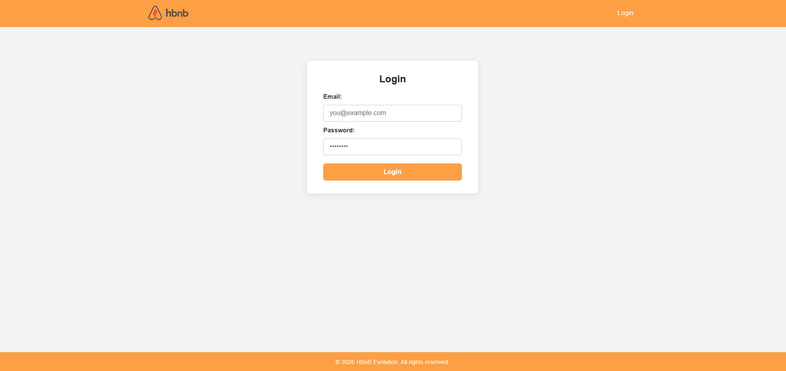

The form has two fields (Email, Password) and a Login button.
If a required field is empty and you click Login, the browser's native HTML5 validation triggers:

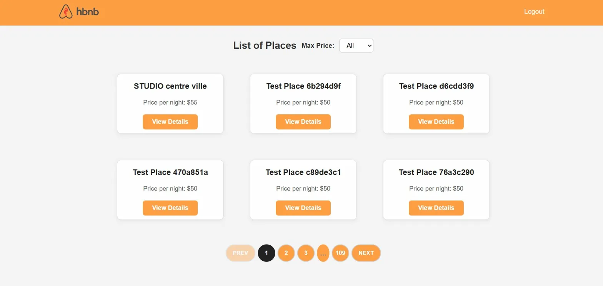

#### Step 2 — Test with wrong credentials

Enter a valid email but the wrong password and click Login.
An **inline red error message** appears immediately — no page reload, no `alert()`:

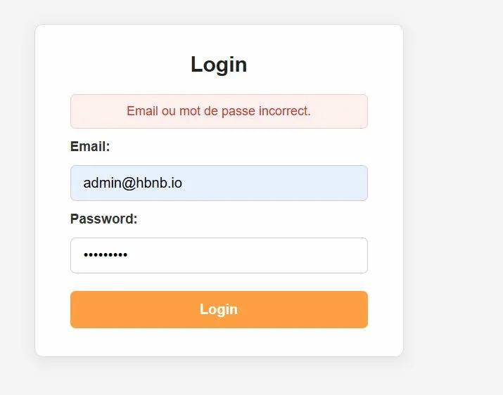

#### Step 3 — Test with valid credentials

Enter the correct email/password of a user created via the API.

**Result:** Redirected to `index.html`. The **Login** button in the header is replaced by **Logout**:


#### Step 4 — Verify the JWT cookie

Open **DevTools → Application → Cookies → localhost:5500**.
A `token` entry is present with the JWT value.

#### Step 5 — Logout

Click **Logout** in the header.
The cookie is deleted and you are redirected to `index.html` with Login restored.

### Code Notes

- Already-logged-in users visiting `login.html` are redirected to `index.html` immediately
- The `#login-error` `<div>` is `display: none` by default — shown only on error, hidden again after 5s
- Zero `alert()` calls in the entire project

---

## Task 2 — View Places

### How It Works

`index.html` fetches all places from the API on load and displays them as cards (9 per page, sorted by most recent first). Two **client-side filters** narrow results without any new API call.

**API call:**
```
GET http://127.0.0.1:5000/api/v1/places
Authorization: Bearer <token>    ← included only if logged in
```

**Key functions in `scripts.js`:**

```js
/**
 * GETs /api/v1/places (with or without token) and calls displayPlaces().
 * Shows an inline error if the fetch fails.
 */
async function fetchPlaces(token) { ... }

/**
 * Sorts places by created_at (newest first), stores the full list in
 * allPlaces, populates the city filter, and renders page 1.
 */
function displayPlaces(places) { ... }

/**
 * Slices places for the requested page and renders 9 place cards.
 */
function renderPlacesPage(places, page) { ... }

/**
 * Builds circular pagination buttons with ellipsis for large page counts.
 */
function renderPaginationControls(places, page) { ... }

/**
 * Reads unique city values from the live API data and fills the city <select>.
 */
function populateCityFilter(places) { ... }

/**
 * Wires up price and city filter events.
 * applyFilters() combines both filters on currentData and re-renders.
 */
function initIndexPage() { ... }
```

### How to Test

#### Step 1 — Not logged in

Open `http://localhost:5500/index.html` without a token.
Places are fetched and displayed publicly. **Login** is visible in the header:

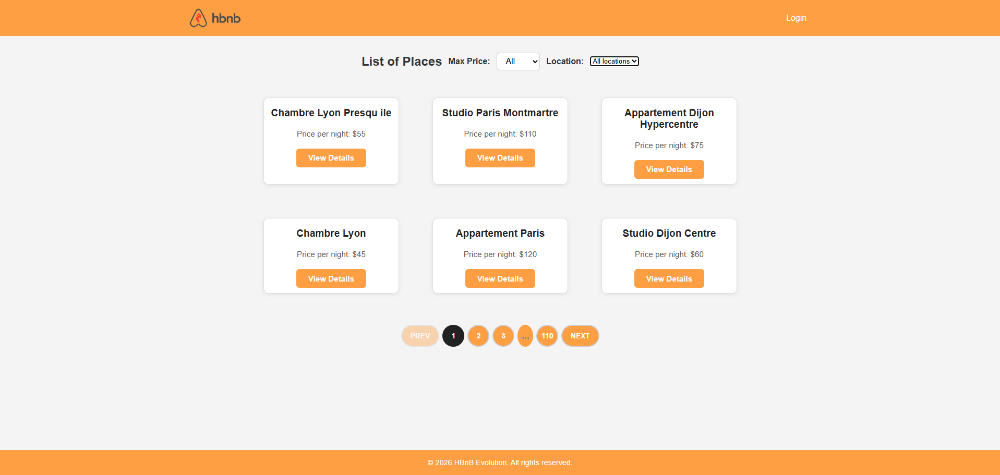

#### Step 2 — Logged in

After login, **Logout** replaces Login. Places are fetched with the JWT token:


#### Step 3 — Price filter

Select **Max Price: $100** — only places at or under $100/night are shown instantly.
Pagination updates to reflect the filtered count:

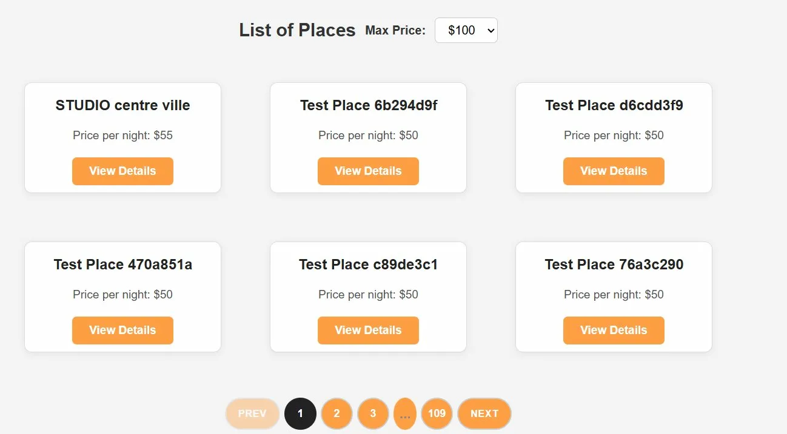

#### Step 4 — Pagination

With 109 pages of results the controls show: `PREV · 1 · 2 · 3 · … · 109 · NEXT`.
The active page is highlighted in black. PREV is faded on page 1:

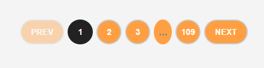

### Code Notes

- `allPlaces` = full unfiltered dataset ; `currentData` = currently filtered view
- Both filters are combined in a single `applyFilters()` function — no redundant API calls
- If no places match the active filters, a grey "No places match this filter." message is shown
- The city filter is populated **dynamically** from the real API data — it shows only cities that actually exist in the current dataset

---

## Task 3 — View Place Details

### How It Works

`place.html` loads full information for a specific place using its UUID from the URL query string (`?id=<uuid>`). Up to **5 API calls** are made to assemble the complete view:

```
1. GET /api/v1/places/<id>            → title, price, description
2. GET /api/v1/places/<id>/amenities  → amenity list (if absent from place object)
3. GET /api/v1/users/<owner_id>       → host full name
4. GET /api/v1/places/<id>/reviews    → review list (if absent from place object)
5. GET /api/v1/users/<user_id>        → author name per review  (parallel via Promise.all)
```

**Key functions in `scripts.js`:**

```js
/**
 * Orchestrates all API calls.
 * Each call is wrapped in try/catch — a failing sub-call never crashes the page.
 */
async function fetchPlaceDetails(token, placeId) { ... }

/**
 * Renders host, price, description, amenities, reviews with stars.
 * Sets the href of #add-review-link to add_review.html?id=<uuid>.
 */
function displayPlaceDetails(place) { ... }

/**
 * Entry point: checks auth, shows or hides #add-review section accordingly.
 */
function initPlacePage() { ... }
```

### How to Test

#### Step 1 — View details (not logged in)

Click **View Details** on any card.
The page shows host, price, description, amenities, and all reviews with star ratings.
The **Add a Review** section is **hidden**:

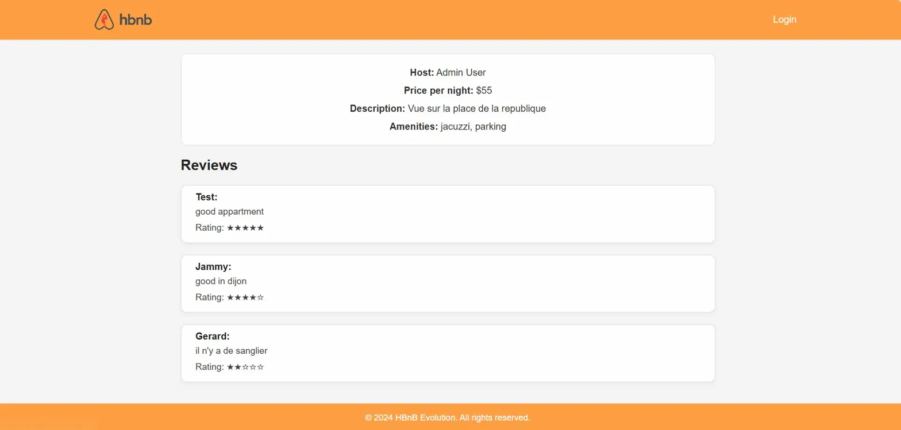

#### Step 2 — View details (logged in)

When logged in the **Write a Review** button appears at the bottom of the page.
Reviews are displayed as cards with reviewer name, comment text, and star rating:

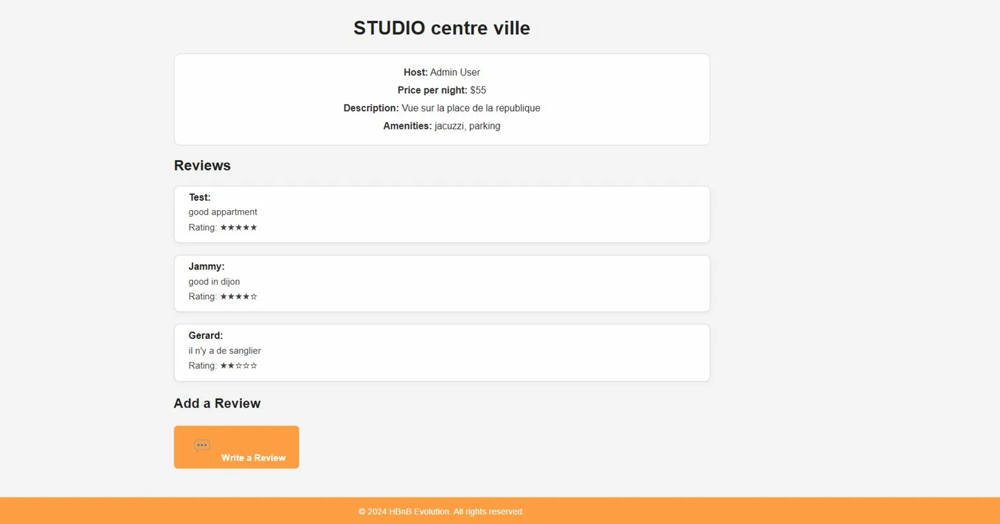

Full place page with multiple reviews:


#### Step 3 — After submitting a review

The newly submitted review appears immediately on the place page after redirect:

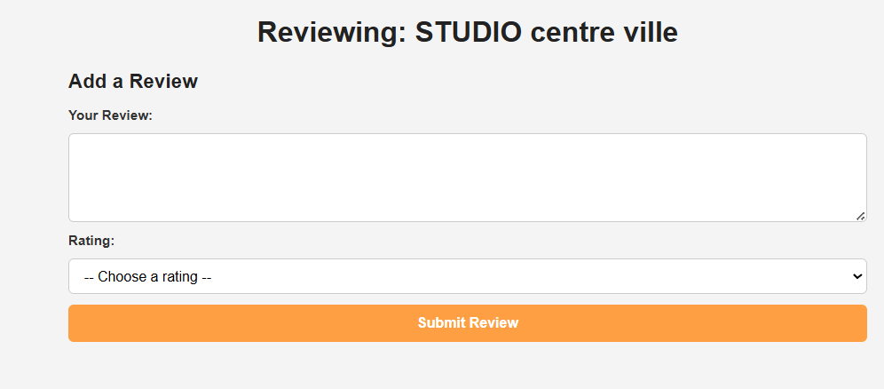

### Code Notes

- All fields use null-safe fallbacks: `??`, `?.`, and default strings (`'N/A'`, `'Anonymous'`, `'No description.'`)
- Host name is resolved from `owner_id`, `host_id`, or `user_id` — whichever field the API returns
- Amenities handle both `string[]` and `{ name: string }[]` response formats
- Review authors are fetched **in parallel** via `Promise.all()` for minimal load time
- Invalid place ID → error message rendered inside `#place-details`, page does not crash

---

## Task 4 — Add Review

### How It Works

`add_review.html` lets a logged-in user submit a review for a specific place.
The place UUID is read from the URL (`?id=<uuid>`).

**API call:**
```
POST http://127.0.0.1:5000/api/v1/reviews
Authorization: Bearer <token>
Content-Type: application/json

{
  "place_id": "<uuid>",
  "text":     "Your review text",
  "rating":   4,
  "user_id":  "<uuid>"   ← decoded from JWT payload, no extra API call needed
}

→ 201  review created
→ 400  validation error (e.g. missing field)
→ 403  cannot review own place / already reviewed
```

JWT decoding to extract `user_id`:
```js
const payload = JSON.parse(atob(token.split('.')[1]));
const userId  = payload.sub || payload.identity;
```

**Key functions in `scripts.js`:**

```js
/**
 * Checks for a valid token cookie.
 * If absent → immediately redirects to index.html (form never renders).
 */
function checkAuthentication() { ... }

/**
 * Decodes JWT (separate try/catch), builds request body, POSTs to /api/v1/reviews.
 * JWT decode failure → inline error + redirect to login.html after 2s.
 * Network failure    → inline network error message.
 */
async function submitReview(token, placeId, reviewText, rating) { ... }

/**
 * Handles the API response.
 * Success → green message + form.reset() + redirect to place page after 1.5s.
 * Failure → red inline error with the API's error detail.
 */
function handleResponse(response, data) { ... }

/**
 * Entry point:
 *   1. checkAuthentication()
 *   2. Fetch place title from API → update <h1> and document.title
 *   3. Wire up form submit with client-side validation
 */
function initAddReviewPage() { ... }
```

### How to Test

#### Step 1 — Access without a token

Navigate directly to `add_review.html?id=<any-uuid>` without being logged in.
You are **immediately redirected** to `index.html` — the form never renders.

#### Step 2 — Open the review form

Log in, click **View Details** on a place, then click **Write a Review**.
The page title shows the place name (fetched dynamically):


The browser's built-in `required` validation prevents empty submission at the HTML level:

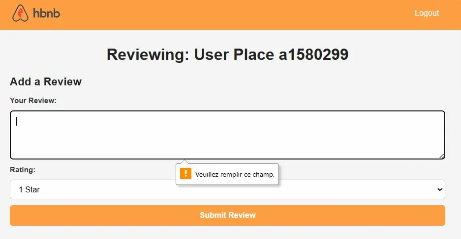

#### Step 3 — Successful submission

Fill in a review text and select a star rating (1–5), then click **Submit Review**.
A **green success message** appears: *"Review successfully sent!"*
After **1.5 seconds** you are automatically redirected back to the place page:

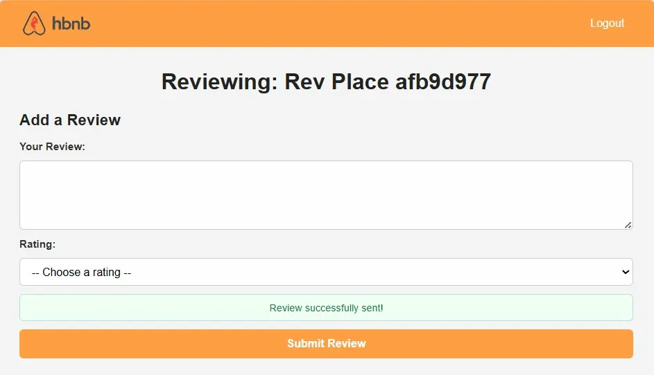

#### Step 4 — API error: duplicate review

Try submitting a second review for the same place.
The API returns a 403. A **red error message** appears inline with the exact API error text:

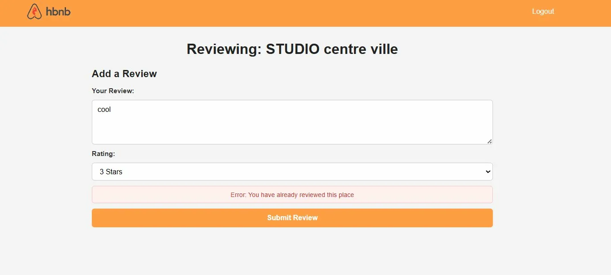

#### Step 5 — API error: reviewing your own place

Try submitting a review on a place you own.
The API rejects it with a specific message displayed inline:

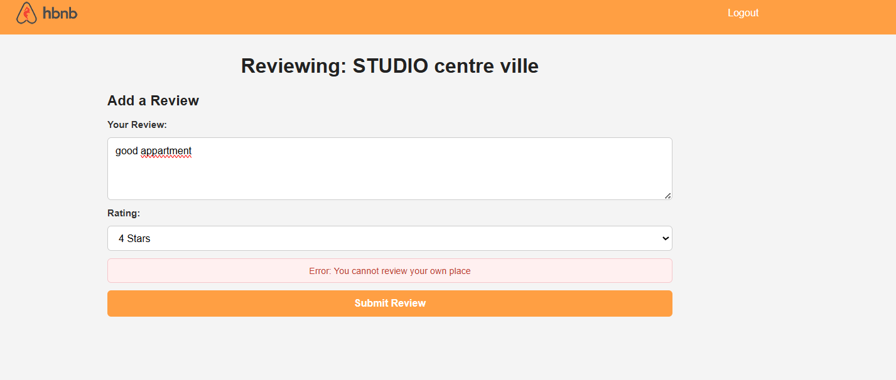

### Code Notes

- `checkAuthentication()` is called **first** — unauthenticated users never see the form
- JWT decoding is in its **own `try/catch`**, separate from the network error handler
- Malformed JWT → red message + redirect to `login.html` after 2 seconds
- `form.reset()` is called on success before the redirect — leaves the form clean
- **Zero `alert()` calls** anywhere in the project — all feedback is inline

---

## File Structure

```
hbnb-frontend/
├── index.html          ← List of places (price + city filter, pagination)
├── login.html          ← JWT login form
├── place.html          ← Place details + reviews + add-review access
├── add_review.html     ← Review submission form
├── scripts.js          ← All JS: routing, API calls, DOM manipulation
├── styles.css          ← Global styles shared across all 4 pages
├── README.md           ← This file
└── images/
    ├── logo.png
    ├── icon.ico
    ├── icon.png
    └── icon-comment.png
```